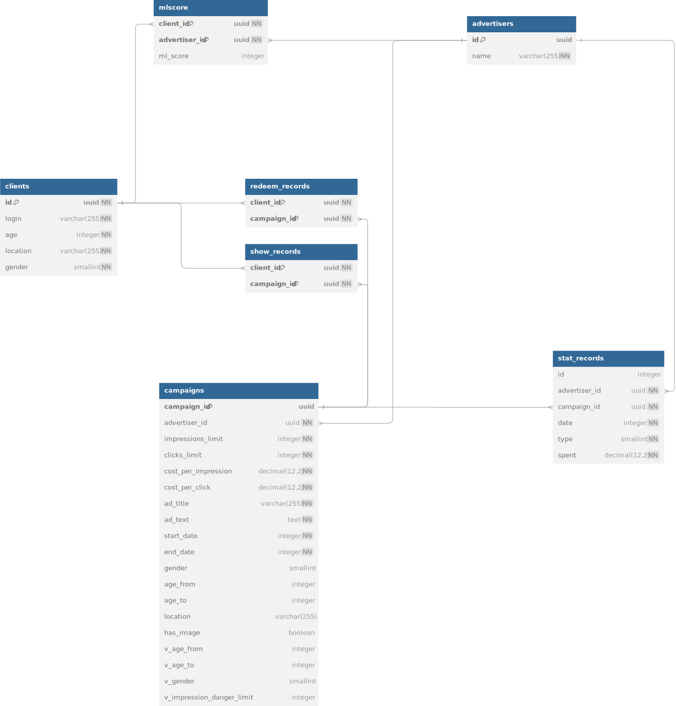

## СТРУКТУРА ДАННЫХ POSTGRESQL
Эта структура данных SQL представляет собой схему базы данных для рекламной платформы с поддержкой таргетинга, статистики и машинного обучения. Вот краткое описание её основных сущностей и их взаимосвязей:

### 1. **Основные сущности**
- **`config`** – таблица конфигурации приложения с простыми ключ-значение параметрами.
- **`clients`** – пользователи (клиенты) платформы с их основными характеристиками (возраст, локация, пол).
- **`advertisers`** – рекламодатели, которые создают рекламные кампании.
- **`campaigns`** – рекламные кампании с настройками таргетинга (возраст, пол, география) и финансовыми параметрами (стоимость за показ/клик).
- **`filtered_campaigns`** – база данных с внесёнными изменениями в рекламные кампании для модерации
- **`mlscore`** – таблица, хранящая предсказанные оценки (machine learning score) соответствия клиентов рекламодателям.

### 2. **История и статистика**
- **`metric_history`** – хранит историю метрик за определённые даты.
- **`stat_records`** – записи статистики по рекламным кампаниям (затраты, дата, тип события).
- **`show_records`** – фиксация фактов показа рекламы клиенту.
- **`redeem_records`** – фиксация того, что клиент «забрал» (воспользовался) рекламным предложением.

### 3. **Ключевые аспекты**
- **Генерация значений**: `campaigns` использует **генерируемые столбцы** (`v_age_from`, `v_age_to`, `v_gender`, `v_impression_danger_limit`) для упрощения фильтрации и анализа.
- **Индексы**:
  - Улучшена производительность запросов за счёт индексирования по:
    - датам (`start_date`, `end_date`),
    - таргетинговым параметрам (`v_age_from`, `v_age_to`, `location`, `v_gender`),
    - рекламодателям (`advertiser_id`),
    - стоимости (`cost_per_impression`, `cost_per_click`).

## Общая схема подключений

Вот описание связей структуры базы данных, представленной в виде схемы:

- **Клиенты (`clients`) и рекламодатели (`advertisers`) связаны через `mlscore`**, которая хранит их предсказанный рейтинг.  

- **Клиенты (`clients`) и рекламные кампании (`campaigns`) связаны через `show_records` и `redeem_records`**:  
  - `show_records` фиксирует, какие объявления видел клиент.  
  - `redeem_records` фиксирует, с какими кампаниями клиент взаимодействовал.  

- **Рекламные кампании (`campaigns`) связаны с рекламодателями (`advertisers`)** — каждый рекламодатель может иметь несколько кампаний.  

- **`stat_records` содержит статистику по рекламным кампаниям и связывается с `campaigns` и `advertisers`**.

## Описание аттрибутов

## **1. `clients` (Клиенты)**
Хранит информацию о пользователях системы.

| Атрибут    | Тип данных     | Описание                                    |
|------------|----------------|---------------------------------------------|
| `id`       | `uuid`         | Уникальный идентификатор клиента.           |
| `login`    | `varchar(255)` | Уникальное имя пользователя.                |
| `age`      | `integer`      | Возраст клиента.                            |
| `location` | `varchar(255)` | Географическое местоположение клиента.      |
| `gender`   | `smallint`     | Пол клиента (`0` - Женский, `1` - Мужской). |

---

## **2. `advertisers` (Рекламодатели)**
Содержит данные о компаниях-рекламодателях.

| Атрибут | Тип данных     | Описание                                |
|---------|----------------|-----------------------------------------|
| `id`    | `uuid`         | Уникальный идентификатор рекламодателя. |
| `name`  | `varchar(255)` | Название компании.                      |

---

## **3. `campaigns` (Рекламные кампании)**
Описывает активные рекламные кампании.

| Атрибут                     | Тип данных                   | Описание                                                       |
|-----------------------------|------------------------------|----------------------------------------------------------------|
| `campaign_id`               | `uuid`                       | Уникальный идентификатор кампании.                             |
| `advertiser_id`             | `uuid`                       | Ссылка на рекламодателя, создавшего кампанию.                  |
| `impressions_limit`         | `integer`                    | Максимальное количество показов.                               |
| `clicks_limit`              | `integer`                    | Максимальное количество кликов.                                |
| `cost_per_impression`       | `decimal(12,2)`              | Стоимость одного показа.                                       |
| `cost_per_click`            | `decimal(12,2)`              | Стоимость одного клика.                                        |
| `ad_title`                  | `varchar(255)`               | Заголовок рекламного объявления.                               |
| `ad_text`                   | `text`                       | Описание рекламного объявления.                                |
| `start_date`                | `integer`                    | Дата начала кампании.                                          |
| `end_date`                  | `integer`                    | Дата окончания кампании.                                       |
| `gender`                    | `smallint`                   | Таргетинг по полу (`0` - Женщины, `1` - Мужчины, `2` - Любой). |
| `age_from`                  | `integer`                    | Минимальный возраст для таргетинга.                            |
| `age_to`                    | `integer`                    | Максимальный возраст для таргетинга.                           |
| `location`                  | `varchar(255)`               | Географический таргетинг.                                      |
| `has_image`                 | `boolean`                    | Флаг наличия изображения (`true` - есть, `false` - нет).       |
| `v_age_from`                | `integer` (Сгенерированное)  | Значение `age_from`, по умолчанию `0`, если не указано.        |
| `v_age_to`                  | `integer` (Сгенерированное)  | Значение `age_to`, по умолчанию `200`, если не указано.        |
| `v_gender`                  | `smallint` (Сгенерированное) | Значение `gender`, по умолчанию `2`.                           |
| `v_impression_danger_limit` | `integer` (Сгенерированное)  | Лимит показов * 1.04%                                          |

---

## **4. `filtered_campaigns` (Кампании, попавшие в таблицу модерации)**
Содержит аналогичные данные, что и `campaigns`, но с дополнительным флагом.

| Атрибут                           | Тип данных | Описание                                                |
|-----------------------------------|------------|---------------------------------------------------------|
| *Все атрибуты, как в `campaigns`* |
| `is_new`                          | `boolean`  | Флаг новой кампании (`true` - новая, `false` - старая). |

---

## **5. `mlscore` (Рейтинг модели машинного обучения)**
Содержит прогнозные оценки взаимодействия клиентов с рекламодателями.

| Атрибут         | Тип данных | Описание                                                            |
|-----------------|------------|---------------------------------------------------------------------|
| `client_id`     | `uuid`     | Ссылка на клиента.                                                  |
| `advertiser_id` | `uuid`     | Ссылка на рекламодателя.                                            |
| `ml_score`      | `integer`  | Оценка взаимодействия (чем выше, тем больше вероятность конверсии). |

---

## **6. `stat_records` (Статистика рекламных кампаний)**
Хранит данные о расходах на рекламу.

| Атрибут         | Тип данных      | Описание                               |
|-----------------|-----------------|----------------------------------------|
| `id`            | `integer`       | Уникальный идентификатор записи.       |
| `advertiser_id` | `uuid`          | Ссылка на рекламодателя.               |
| `campaign_id`   | `uuid`          | Ссылка на кампанию.                    |
| `date`          | `integer`       | Дата события.                          |
| `type`          | `smallint`      | Тип события (`0` - Показ, `1` - Клик). |
| `spent`         | `decimal(12,2)` | Затрата на событие.                    |

---

## **7. `redeem_records` (Активация кампании клиентами)**
Фиксирует клиентов, использовавших рекламное предложение.

| Атрибут       | Тип данных | Описание            |
|---------------|------------|---------------------|
| `client_id`   | `uuid`     | Ссылка на клиента.  |
| `campaign_id` | `uuid`     | Ссылка на кампанию. |

---

## **8. `show_records` (Фиксация показов рекламы)**
Хранит информацию о том, какие клиенты видели рекламу.

| Атрибут       | Тип данных | Описание            |
|---------------|------------|---------------------|
| `client_id`   | `uuid`     | Ссылка на клиента.  |
| `campaign_id` | `uuid`     | Ссылка на кампанию. |

---

## **9. `metric_history` (История метрик)**
Хранит метрики, относящиеся к рекламе, по датам.

| Атрибут       | Тип данных      | Описание                                              |
|---------------|-----------------|-------------------------------------------------------|
| `date`        | `integer`       | Дата записи.                                          |
| `metric_name` | `varchar(255)`  | Название метрики (например, `clicks`, `impressions`). |
| `amount`      | `decimal(12,2)` | Значение метрики.                                     |

---

## **10. `config` (Настройки системы)**
Содержит параметры конфигурации.

| Атрибут | Тип данных     | Описание                            |
|---------|----------------|-------------------------------------|
| `id`    | `integer`      | Уникальный идентификатор настройки. |
| `value` | `varchar(255)` | Значение настройки.                 |

---
## СТРУКТУРА ДАННЫХ REDIS
В Redis используется структура данных списков для кеширования рекламных объявлений по пользователям.  

### **Формат ключей:**  
`cache:ads:$id`, где `$id` — идентификатор пользователя.  

#### В этих списках хранятся идентификаторы рекламных объявлений, отобранных для пользователя.

### **Особенности кеширования:**  
- **Время жизни (TTL)** — 60 секунд, чтобы избежать избыточных запросов в БД и обеспечить актуальность рекламы.
- **Использование списков** — позволяет быстро получать набор объявлений для пользователя и поддерживает операции, такие как `LPOL` и `RPUSH`.

### **Преимущества использования Redis в данном проекте:**  
✅ Ускорение выборки рекламы для пользователей.  
✅ Снижение нагрузки на PostgreSQL.  
✅ Гибкость управления TTL и обновления кеша.