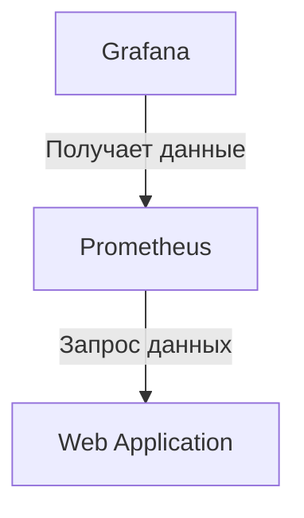
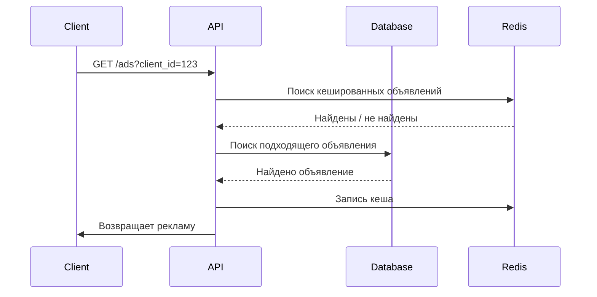

# Рекламная платформа

## Описание проекта
Рекламная платформа — это веб-приложение, позволяющее размещать, управлять и анализировать рекламные кампании.
Система поддерживает гибкую настройку таргетинга, аналитику и имеет в себе функции ИИ.

## Основные возможности
- Создание и управление рекламными кампаниями
- Настройка таргетинга по аудитории
- Отчеты и аналитика по показам и кликам
- Интеграция с внешними сервисами

## Быстрый старт
### Запуск с Docker
1. Убедитесь, что у вас установлен [Docker](https://www.docker.com/) и [Docker Compose](https://docs.docker.com/compose/).
2. Склонируйте репозиторий:
   ```sh
   git clone https://gitlab.prodcontest.ru/2025-final-projects-back/georglider
   cd georglider/solution
   ```
3. Запустите приложение с помощью Docker Compose в Detached режиме:
   ```sh
   docker-compose up -d
   ```
4. Приложение будет доступно по адресу: `http://localhost:8080`

### Структура Docker Compose
Помимо самого приложения, у нас есть 5 контейнеров:
- postgres (отвечает за хранение данных)
- redis (отвечает за кеширование данных)
- minio (работает s3 хранилищем)
- prometheus
- grafana

Первые 3 контейнера являются зависимостями нашего приложения и соединяются с ним по внутренним портам docker сети

Prometheus и Grafana, в свою очередь, являются инструментами для отображения графиков и мониторинга приложения и имеют такую схему подключения:



Контейнеры, данные которых генерируются полностью самостоятельно или через Web приложение, располагают свои данные в папке .data. Prometheus помимо генерируемых данных, нуждается в файле `prometheus.yml`, который является его конфигурацией. Grafana, в свою очередь, имеет папку grafana с предварительно внесёнными дешбордами и источником данных (подключение с prometheus) для работы

Все переменные среды указаные у контейнеров (кроме Grafana) нужны для работы Web приложения:

| Переменная среды    | Описание                              | Значение в `docker-compose.yml` |
|---------------------|---------------------------------------|---------------------------------|
| `POSTGRES_DB`       | Имя базы данных PostgreSQL            | `prod`                          |
| `POSTGRES_USER`     | Пользователь базы данных              | `server`                        |
| `POSTGRES_PASSWORD` | Пароль для пользователя базы данных   | `w7X...YnA`                     |
| `POSTGRES_HOST`     | Хост PostgreSQL (название контейнера) | `postgres`                      |
| `REDIS_HOST`        | Хост Redis (название контейнера)      | `redis`                         |
| `MINIO_HOST`        | Хост MinIO (название контейнера)      | `minio`                         |
| `MINIO_ACCESS_KEY`  | Ключ доступа MinIO                    | `ox2...uNc`                     |
| `MINIO_SECRET_KEY`  | Секретный ключ MinIO                  | `g92...5gw`                     |
| `AI_KEY`            | API-ключ для сервиса AI               | `2TR...JyE`                     |


Для ознакомления с графиками Grafana можно перейти по адресу `http://localhost:3000`, переменные `GF_SECURITY_ADMIN_USER` и `GF_SECURITY_ADMIN_PASSWORD` отвечают за логин и пароль дешборда графаны соответсвенно


## API и документация
#### Для работы с API используйте Swagger UI по адресу [https://editor.swagger.io/](https://editor.swagger.io/) вместе с файлом `openapi.yaml` в данной папке

## Описание работы метода показа рекламы

### Основные точки входа API

### 1. Получение рекламного объявления
**Метод:** `GET /ads`
- **Входные параметры:**
  - `client_id` (UUID клиента)
- **Алгоритм работы:**
  1. Проверяется существование клиента в системе.
  2. Производится попытка найти закешированные объявления для пользователя.
  3. Если попытка успешна, то программа пытается получить первое объявление, которое не превышает `v_impression_danger_limit`, иначе (если оно не было найдено) производится поиск объявления в базе данных
     **Поиск рекламного объявления в базе данных**:
     - SQL запрос, который:
       1. Фильтрует по таргетингу доступные для клиента рекламные объявления
       2. Проверяет не было ли уже просмотра объявления пользователем
       3. Считает релевантность (по ML скору объявления и максимума среди остальных), потенциальную прибыль и процент прохождения по выполнению лимита
       4. Ставит оценку и берёт лучшие
     - Производится повторная проверка, что у объявления не было перехода за лимит показов
     - Первое берётся в результат, остальные семь или меньше объявлений уходят в кеш Redis
  4. Если объявление было найдено, то:
     - Производится показ объявления
  5. Если даже так не удалось найти объявление, то
     - Производится попытка получить уже просмотренное объявление с наилучшим ML скором, а также где не было клика (сначала сортировка по тому, где не было клика, затем ML скор)
     - Иначе:
        - Возвращается ошибка `404 Not Found`.

### 2. Фиксация клика по рекламе
**Метод:** `POST /ads/{adId}/click`
- **Входные параметры:**
  - `adId` (UUID объявления)
  - `client_id` (UUID клиента)
- **Алгоритм работы:**
  1. Проверяется существование клиента и объявления.
  2. Если да:
     - Фиксируется клик в системе.
     - Обновляется статистика рекламной кампании (увеличение кликов, расходов (с учётом, в первый ли раз пользователь переходит на объявление)).
     - Возвращается `204 No Content`.
  3. Если клиент не видел рекламу ранее:
     - Возвращается ошибка `403 Forbidden`.

### 3. Получение изображения рекламного объявления
**Метод:** `GET /ads/{adId}/image`
- **Входные параметры:**
  - `adId` (UUID объявления)
- **Алгоритм работы:**
  1. Проверяется существование изображения для объявления.
  2. Если изображение есть:
     - Отдаётся файл изображения (PNG/JPEG).
  3. Если изображения нет:
     - Возвращается ошибка `404 Not Found`.

## Диаграмма взаимодействия


## Описание методов работы модерации

**Методы:**
  - `POST /moderation/enable` - Включение модерации
  - `POST /moderation/disable` - Отключение модерации
  - `GET /moderation/status` - Получение текущего статуса модерации
  - `GET /moderation/requests` - Получение списка запросов на модерацию
  - `GET /moderation/request` - Получение одного запроса на модерацию
  - `POST /moderation/approve` - Одобрение рекламной кампании
  - `POST /moderation/reject` - Отклонение рекламной кампании

**Алгоритм работы модерации:**
- Запрос на создание/изменение рекламной кампании поступает в систему:
     1. Создание:
        - Кампания заносится в отдельную базу данных (фильтр)
        - В запросах на модерацию появляются данные этой самой кампании
        - Модератор берёт ID этой кампании и решает:
          1. Одобрить запрос:
             - Запрос удаляется из базы данных фильтра
             - Создаётся запись в основной базе данных, по которой пользователи могут на неё перейти
          2. Отклонить запрос
             - Запись удаляется из базы данных фильтра
    2. Изменение:
       - Система проверяет, менялись ли поля с текстом у тела кампании:
         1. Если не менялись:
            - Все поля обновляются напрямую в основной базе данных
         2. Если менялись:
            - Поля не связанные с текстом обновляются напрямую в основной базе данных
            - Объект с желанными рекламодателем полями сохраняется в базе данных фильтра
            - В запросах на модерацию появляются данные этой самой кампании
            - Модератор берёт ID этой кампании и решает:
              1. Одобрить запрос:
                 - Запрос удаляется из базы данных фильтра
                 - Обновляется запись текстов в основной базе данных, по которой пользователи могут на неё перейти
              2. Отклонить запрос
                 - Запись удаляется из базы данных фильтра

## Описание методов работы интеграции с ИИ
**Методы:**
  - `POST /advertisers/{advertiserId}/generation/stream` - Стриминговая генерация текста для объявления с опорой на заголовок и название рекламодателя
  - `POST /advertisers/{advertiserId}/generation` - Обычная генерация текста для объявления с опорой на заголовок и название рекламодателя

**🔹 Параметры:**  
- `advertiserId` – Идентификатор рекламодателя.

**Тело запроса:**  
```json
{
  "title": "Название объявления"
}
```
**Ответы:**  
- `200 OK` – Успешный ответ с текстом объявления.
- `429 Too Many Requests` – Превышен лимит запросов.  
- `404 Not Found` – Рекламодатель не найден.  
- `400 Bad Request` – Некорректные данные.


## [Информация о работе базы данных](./DATABASE.md)

## Информация о тестировании

### Выбор технологий  
Для обеспечения надежности и полноты тестирования использованы:  
- **Testcontainers** – для интеграционного тестирования с реальными зависимостями  
- **Kover** – для измерения покрытия кода тестами 

По большей части в моём приложении располагаются интеграционные тесты, так как это дало ряд преимуществ над обычными Unit и E2E тестами

- Тесты не только проверяют бизнес-логику, но и взаимодействие компонентов в реальной среде
- Упрощённая проверка валидации полученных параметров
- Симулируются реальные сценарии работы приложения
- Использование Testcontainers позволяет тестировать с реальными зависимостями (PostgreSQL, MinIO, Redis)
- Максимально покрыты критические части системы, обеспечивая стабильность в продакшене

Таким образом, используя инструмент Kover, моё общее покрытие кода составляет:

| Метрика         | Покрытие | Проверено |
|-----------------|----------|-----------|
| **Классы**      | 83.6%    | 224/268   |
| **Методы**      | 85.8%    | 435/507   |
| **Ветви кода**  | 70.8%    | 170/240   |
| **Строки кода** | 88.7%    | 1269/1431 |
| **Инструкции**  | 90.3%    | 7967/8818 |

Хотя итоговое покрытие кода **очень высокое (90.3% инструкций, 88.7% строк кода)**, важно понимать:  

- **Приоритет был у важных компонентов** – сервисный и контроллерный слой покрыты максимально  
- **Интеграционные тесты проверяют реальную работу системы** – а не просто отдельные методы  
- **Низкое покрытие в некоторых местах – осознанное решение** (не тестировались простые структуры данных и конфигурации)  

#### Инструкция по запуску тестов
```sh
cd app
./gradlew test            # Запуск всех тестов (unit, integration, e2e)
./gradlew unitTest        # Запуск только unit-тестов
./gradlew integrationTest # Запуск только интеграционных тестов

./gradlew koverHtmlReport # Запуск анализа покрытия кода
```

## Обоснованность решения

### **Выбор технологий: WebFlux, Spring Boot, Kotlin**  

### **1. Spring Boot**
#### **Ключевые причины выбора:**  
- **Быстрый старт и удобная конфигурация** – минимальные настройки, встроенные механизмы автоконфигурации.   
- **Огромная экосистема** – поддержка **Spring Data, Security, Actuator, AI**, интеграция с Redis, MinIO и другими сервисами.  
- **Observability (наблюдаемость)** – удобная интеграция с **Prometheus** для мониторинга.

#### **2. Почему WebFlux? (а не Spring MVC)**  
Я выбрал **Spring WebFlux** вместо **Spring MVC**, потому что этот проект требует **реактивного программирования**.  

#### **Ключевые причины выбора:**  
- **Высокая производительность** – WebFlux не блокирует потоки, что особенно полезно при работе с БД (R2DBC), Redis и MinIO.  
- **Отлично подходит для высоконагруженных систем** – WebFlux лучше справляется с большим количеством одновременных запросов.  
- **На мой взгляд, более удобный Exception Handling** – В WebFlux обработка ошибок встроена в реактивные цепочки, что делает код более декларативным и удобным.

### **Когда WebFlux лучше, чем Spring MVC?**  
| Сценарий                                       | WebFlux (✅) | Spring MVC (❌) |
|------------------------------------------------|-------------|----------------|
| Высокая нагрузка, много одновременных запросов | ✅           | ❌              |
| Много асинхронных операций (БД, Redis, MinIO)  | ✅           | ❌              |
| Низкое потребление памяти и CPU                | ✅           | ❌              |
| Простые CRUD-операции без сложной логики       | ❌           | ✅              |


#### **3. Почему Kotlin? (а не Java)**
#### **Ключевые причины выбора:**  
- **Более лаконичный код** – меньше шаблонного кода по сравнению с Java (например, data-классы вместо стандартных POJO).  
- **Безопасность типов (Null Safety)** – меньше NullPointerException, которые являются одной из главных проблем в Java.  
- **Лучшая поддержка функционального программирования** – удобные **lambda-функции, коллекции, extension-функции**.  
- **Простая интеграция с Java** – можно использовать любую библиотеку из экосистемы Java.

### Выбор СУБД и внешних зависимостей
### **1. PostgreSQL**
#### **Ключевые причины выбора:**
- Отличная поддержка R2DBC – важный фактор, поскольку мы используем Spring Boot WebFlux (реактивный стек).
- Надёжность
- Сообщество и экосистема
### **2. Redis**
#### **Ключевые причины выбора:**
- Высокая скорость
- Удобная библиотека Reactive Redis
- Наличие TTL
### **3. Minio**
#### **Ключевые причины выбора:**
- S3-совместимое API (!Важно, так как мы используемся библиотеку от Amazon)
- Легкое создание контейнера
- Сообщество
### **4. Prometheus**
- Легкая интеграция - поддержка Spring Boot Actuator позволяет легко получать метрики
- Легкое создание контейнера
- Удобный и простой язык PromQL
### **5. Grafana**
- Гибкость в настройке дашбордов
- Простая интеграция с Prometheus 
- Сообщество